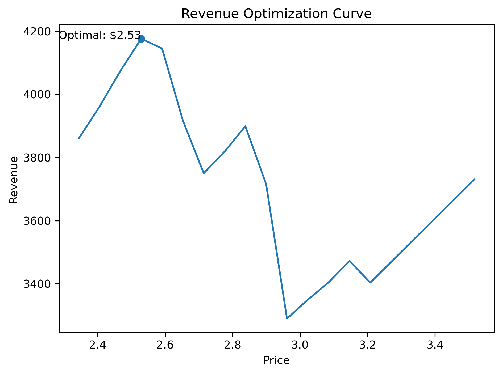
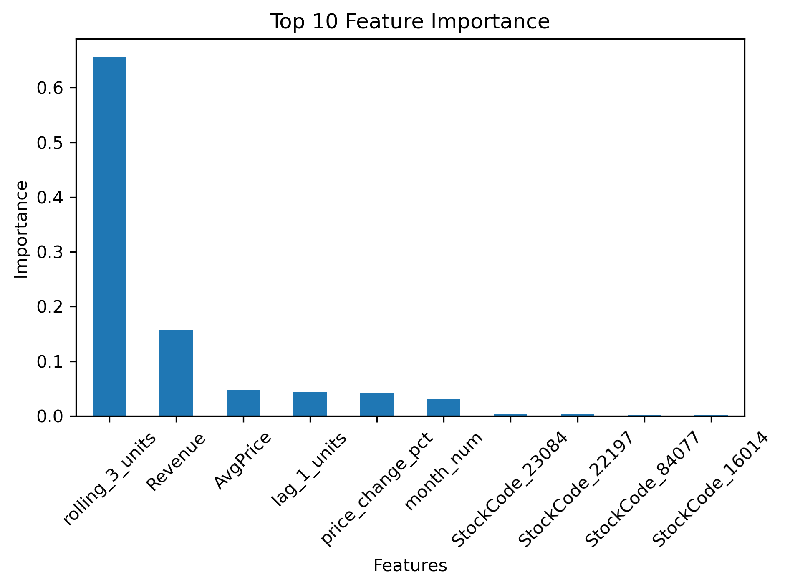

# 📊💰 Retail Revenue Optimization

---

## 🔍 Overview
This project builds a machine learning-driven pricing strategy to identify the optimal price point that maximizes revenue.

Using historical retail transaction data, a demand model was developed to simulate how changes in price impact customer purchasing behavior.

The analysis identifies a revenue-maximizing price and demonstrates how data-driven pricing decisions can significantly improve business performance.

---

## 📌 Executive Summary

A machine learning model was developed to estimate demand as a function of price and historical purchasing behavior.

By simulating demand across different price points, the analysis identified an optimal price of **$2.53**, which maximizes revenue at approximately **$4,176**.

Compared to baseline pricing, this approach demonstrates how retailers can systematically improve pricing decisions using predictive analytics rather than intuition.

This project highlights the value of:
- Demand forecasting
- Scenario simulation
- Data-driven decision making

These techniques are directly applicable to real-world pricing optimization and revenue strategy.
This approach can be extended to profit optimization, dynamic pricing systems, and real-time decision engines in production environments.

___

## 🎯 Business Problem
Retailers must balance price and demand:
- Increasing price raises revenue per unit but reduces demand
- Decreasing price increases demand but lowers revenue per unit

The challenge is to find the **optimal price point that maximizes total revenue**.

---

## 🧠 Approach

### 1. Data Preparation
- Cleaned and structured transactional retail data
- Handled missing values and ensured consistency

### 2. Feature Engineering
Created features to capture demand patterns:
- Lag demand (`lag_1_units`)
- Rolling averages (`rolling_3_units`)
- Price change percentage
- Seasonal features (month, year)
- Product-level encoding (StockCode)

### 3. Modeling
- Model: Random Forest Regressor  
- Target: Units Sold  

**Performance:**
- MAE: 367.73  
- R²: 0.73


### 4. Price Simulation
Demand was simulated across a range of prices using the trained model.

Revenue was calculated as:
- Revenue = Price × Predicted Demand


---

## 🏆 Key Results

| Metric | Value |
|------|------|
| Optimal Price | $2.53 |
| Predicted Demand | ~1651 units |
| Maximum Revenue | ~$4,176 |

### Interpretation
- Revenue increases with price up to an optimal point, after which demand drops sharply
- The relationship between price and demand is non-linear
- Small pricing changes can have a significant impact on total revenue

### Baseline Comparison
Compared to an average historical price, the optimized pricing strategy shows the potential to increase revenue by identifying a more effective balance between price and demand. If applied at scale across multiple products, even small pricing improvements could translate into significant revenue gains.

---

## 📈💰 Revenue Optimization

This curve shows how revenue changes across different pricing levels,
highlighting the optimal price point that maximizes revenue



## 📊 Feature Importance

The model identified **price and recent demand trends** as the most influential features.

This indicates:
- Pricing decisions have a direct and significant impact on demand
- Recent sales patterns are strong predictors of future demand



---

## 🤖 Model Selection

A Random Forest Regressor was selected due to its ability to capture non-linear relationships between price and demand.

Future improvements include:
- Comparing performance with Linear Regression and Gradient Boosting
- Hyperparameter tuning
- Cross-validation for robustness

___

## 💡 Key Insights

- Demand exhibits a non-linear relationship with price
- Revenue increases with price up to a peak, then declines as demand drops
- A small number of features (price and recent demand) drive most of the predictive power
- Many engineered features contribute minimal additional value
- This suggests pricing should be treated as a dynamic lever rather than a fixed business decision

---

## ⚡ Business Impact

This project demonstrates how retailers can:

- Increase revenue by identifying optimal price points rather than relying on static pricing
- Reduce revenue loss from underpricing or overpricing products
- Use predictive models to guide pricing decisions instead of intuition

In a real-world setting, this approach can be integrated into pricing systems to continuously adapt to demand patterns and market conditions.

---

## ⚠️ Limitations

- No cost data available → profit optimization not included
- Model assumes historical demand patterns persist
- Analysis is limited to single-product optimization

---

## 🚀 Future Improvements

- Incorporate cost data for profit optimization
- Use advanced models (XGBoost / LightGBM)
- Expand to multi-product pricing strategies
- Deploy as a real-time pricing tool
- Integrate with real-time data pipelines for continuous model retraining and price updates

---

## 🧪 Scenario Analysis

This model enables simulation of different pricing strategies before implementation.

Businesses can use this approach to:
- Test pricing scenarios without real-world risk
- Adjust prices dynamically based on demand patterns
- Improve revenue predictability

___

## 📂 Project Structure
```
retail-revenue-optimization/
│
├── README.md
├── requirements.txt
├── Retail Revenue Optimization Report
│
├── models/
│   └── demand_model.pkl
│
├── notebooks/
│   ├── 01_data_cleaning.ipynb
│   ├── 02_feature_engineering.ipynb
│   ├── 03_modeling.ipynb
│   └── 04_price_simulation.ipynb
│
├── data/
│   ├── raw
│   │   └── OnlineRetail.xlsx
│   └── processed
│       ├── agg_data.csv
│       └── model_data.csv
│
└── images/
    ├── revenue_optimization_curve.png
    └── top_10_feature_importance.png

```


---

## ▶️ How to Run

1. Clone the repository:
- git clone https://github.com/japio7/Reports/retail-pricing-optimization.git

2. Install dependencies:
- pip install -r requirements.txt

3. Run notebooks in order:
- 01_data_cleaning
- 02_feature_engineering
- 03_modeling
- 04_price_simulation

---

## 🛠️ Tech Stack

- Python
- Pandas / NumPy
- Scikit-learn
- Matplotlib
- Joblib

---

## 👤 Author

**Jared Pino**  
Master’s in Data Science  

GitHub: https://github.com/japio7

